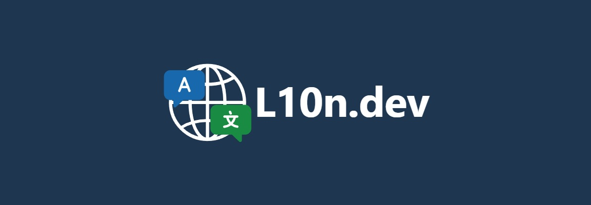

  

<h1 align="center">AI-Powered Localization for Developers</h1>

  Bring intelligent, automated localization directly into your development workflow with seamless integrations.

### **[ai-l10n](https://github.com/l10n-dev/ai-l10n)** - Localization Automation

CLI and TypeScript API for Node.js projects. Integrates with CI/CD pipelines and works with React, Vue, Angular, Next.js, and more.

### **[VS Code Extension](https://github.com/l10n-dev/translate-i18n-vscode)** - One-click localization

Translate i18n files without leaving your IDE. Supports i18next, ICU, JSON, and ARB formats.

### **Explore More**

Discover our full suite of integrations at [l10n.dev/#integrations](https://l10n.dev/#integrations)

---

  <a href="https://l10n.dev">🌐 Website</a> •
  <a href="https://l10n.dev/api/doc">📚 API Docs</a> •
  <a href="https://l10n.dev#pricing">💰 Pricing</a>

  <a href="https://l10n.dev/terms-of-service">Terms of Service</a> •
  <a href="https://l10n.dev/privacy-policy">Privacy Policy</a>

